<h1 align="center">DJ DRKS website</h1>

[View the live project here.](https://thirdelement.github.io/djdarks/)

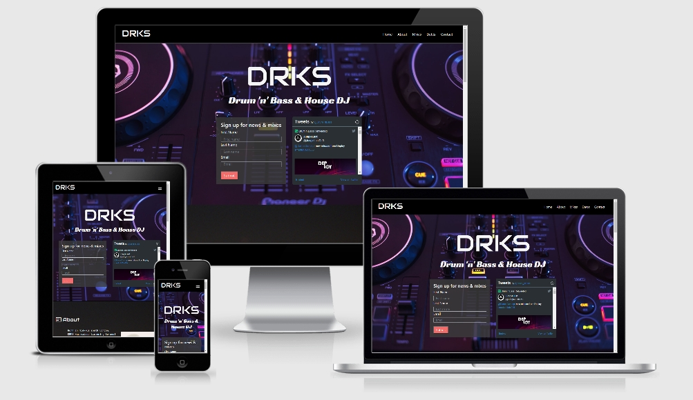

This is the promotional website for DJ DRKS.   It is designed to be viewed on a range of devices including desktop PCs, tablets and phones to aid navigation for long-term fans and new followers alike.

## User Experience (UX)

-   ### User stories

    -   #### First Time Visitor Goals

        1. As a First Time Visitor, I want to understand who DRKS is and what he does.
        2. As a First Time Visitor, I want to find out about DRKS easily and conveniently.
        3. As a First Time Visitor, I want to check if DRKS has social media.
        4. As a First Time Visitor, I want to hear DRKS’ music.

    -   #### Returning Visitor Goals

        1. As a Returning Visitor, I want to send DRKS a message.
        2. As a Returning Visitor, I want to find out when his next live date is.
        3. As a Returning Visitor, I want to check out more of DRKS’ music and social media.

    -   #### Frequent User Goals
        1. As a Frequent User, I want to book DRKS for my party.
        2. As a Frequent User, I want to sign up for news and mixes.
        3. As a Frequent User, I want to book for the next live date.

-   ### Design
    -   #### Colour Scheme
        -   The colours are dark purple, blue and violet with one page of black, grey and orange/yellow.  The navbar is black so it is prominent against all background images.
        
    -   #### Typography
        -   The Audioweb font has been used for the DRKS navbar brand logo, jumbotron header and page headers with Sans Serif as the fallback.  This font is used to give a modern style in keeping with DRKS’ music.
            <h2 align="left">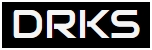</h2>  
        -   The Racing Sans One font has been used for the sub-heading in the jumbotron.  This is similar to the La Macchina font made famous on the Lamborghini logo.  It is used to contrast with the Audioweb logo font, emphasize a stylish, quality product and service.
            <h2 align="left">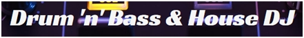</h2>  
        -   The Roboto Mono font has been used for the About page text.  This is a monospace font which is not only known for its readability but also customary on typewriters and typesetting computer code.  It brings a technical, computer-based feel to the site which is again similar to DRKS’ music. 
            <h2 align="left">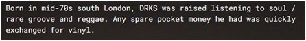</h2> 
        -   The Font colour used throughout is whitesmoke for readability and to reduce glare.  When hovering over navbar menu links a contrasting blue is used to match the purple, blue and violet page backgrounds.  
            <h2 align="left">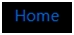</h2>
        -   All forms are in grey with some transparency so as not to detract from the background images.  The submit buttons are red/pink for the sign-up and contact forms and yellow for booking dates.  The red/pink is a standard call-to-action colour and contrasts well with the background image.  Yellow is used for the booking buttons to match the orange filter in the DJ image on the Dates page.
            <h2 align="left">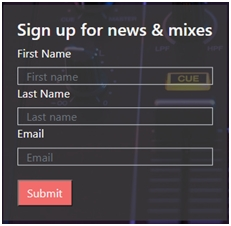</h2>
            <h2 align="left">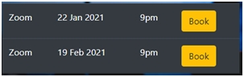</h2>
    -   #### Imagery
        -   The Home page background image is a close-up of some DJ decks immediately illustrating the site subject matter.
            <h2 align="left">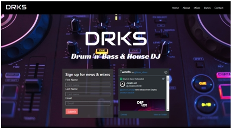</h2>  
        -   The About page background image is the Croydon skyline at night in south London.  This provides some context to the biographical text.  The page also features a portrait picture of DRKS to help the visitor relate to his story.
            <h2 align="left">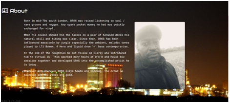</h2> 
        -   The Mixes page background image is a scene from a nightclub.  This is appropriate as it is the type of venue you might hear DRKS’ music.  
            <h2 align="left">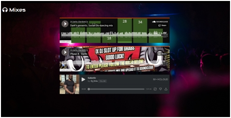</h2>
        -   The Dates page background image is similarly from a nightclub or concert venue.  This is an atmospheric shot featuring blue lighting and dry ice clouds.  On top of this there is an image of DRKS in action with an orange filter which stands out well against the blue. 
            <h2 align="left">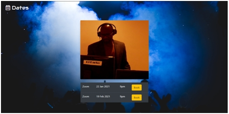</h2>
        -   The Contacts page background image takes us back to the DJ decks as tools of the trade and emphasising again the subject nature of the website.  
            <h2 align="left">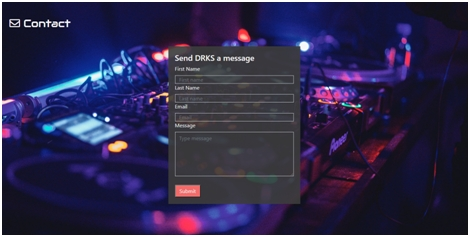</h2>
   
*   ### Wireframes 

    -   Desktop and mobile wireframes - [View](https://github.com/thirdelement/djdarks/blob/master/DJDRKS-wireframes.pdf)
    -   Following the creation of wireframes the design has changed to feature imagery more closely associated with DJs and to include pictures of DRKS.  The broad concept for the site has remained the same.

## Features

-   Responsive on all device sizes tested.
-   Interactive elements include sign-up, contact and booking forms; sound files for streaming and Twitter feed.

## Technologies Used

### Languages Used

-   [HTML5](https://en.wikipedia.org/wiki/HTML5)
-   [CSS3](https://en.wikipedia.org/wiki/Cascading_Style_Sheets)
-   [Javascript](https://en.wikipedia.org/wiki/JavaScript)

### Frameworks, Libraries & Programs Used

1. [Bootstrap 4.5.3:](https://getbootstrap.com/docs/4.5/getting-started/introduction/)
    - Bootstrap was used to assist with the responsiveness and styling of the website.
1. [Google Fonts:](https://fonts.google.com/)
    - Google Fonts were used to import the Audiowide font featured for the DRKS logo and the heading on all except Home pages.  The ‘Racing Sans One’ font used for the jumbotron sub-heading and ‘Roboto Mono’ font chosen for the About page biography text were also imported.
1. [Font Awesome:](https://fontawesome.com/)
    - Font Awesome was used for the icon added to the header for all except Home pages.
1. [jQuery:](https://jquery.com/)
    - jQuery came with Bootstrap to make the navbar responsive.
1. [JavaScript:](https://en.wikipedia.org/wiki/JavaScript)
    - JavaScript was used for the form alert and provided as part of the Bootstrap booking form.
1. [GitPod](https://gitpod.io/)
    - GitPod was used for code editing, version control, committing and pushing to GitHub.
1. [GitHub:](https://github.com/)
    - GitHub was used to store and manage project code pushed from GitPod.
1. [Irfanview:](https://www.irfanview.com/)
    - Irfanview was used to resize, edit and add filters to images.
1. [Balsamiq:](https://balsamiq.com/)
    - Balsamiq was used for [wireframes](https://github.com/thirdelement/djdarks/blob/master/DJDRKS-wireframes.pdf) created during the design process. 

## Testing

The W3C Markup Validation Service and CSS Validation Service were used to validate all project pages ensuring no syntax errors are present.

-   [W3C Markup Validator](https://jigsaw.w3.org/css-validator/#validate_by_input) - [Results](https://github.com/thirdelement/djdarks/blob/master/DJDRKS-HTML-validation.jpg)
-   [W3C CSS Validator](https://jigsaw.w3.org/css-validator/#validate_by_input) - [Results](https://github.com/thirdelement/djdarks/blob/master/DJDRKS-CSS-validation.jpg)

### Testing User Stories from User Experience (UX) Section

-   #### First Time Visitor Goals

    1. As a First Time Visitor, I want to understand who DRKS is and what he does.
        1. The jumbotron on the Home page clearly calls out that this is a site about DJ DRKS.  The background image of DJ decks further confirms this is a site related to a DJ.
        2. The visitor is provided a standard easy-to-use navbar with options to explore the DJ’s biography, mixes, show dates and get in contact.
            <h2 align="left">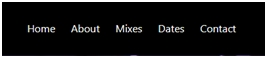</h2>
        3. The About page has a brief description of DRKS’ background, how he started as a DJ and the music he plays.
        4. All imagery throughout the website is related to DJs and music venues.

    2. As a First Time Visitor, I want to be able to easily be able to navigate throughout the site to find content.
        1. The navbar is clearly signposted with menu options that link to the described pages.  Alternatively the site can be scrolled through which might be preferred on a mobile device.
        2. The visitor will receive confirmation on submission of all forms.   When hovering on buttons and options these will respond with a colour or shade change.
            <h2 align="left">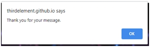</h2>
        3. The site has been laid out in a clear, straightforward way.  The navbar is available on all pages so the visitor never loses any option or way back. 
        4. The sign-up and contact forms include validation for each field where the visitor is prompted to enter a value within the data-type criteria.  Once all criteria are met for each field the submit button can be activated.  The visitor receives a confirmation alert when the submit button is clicked and is returned to the site.
            <h2 align="left">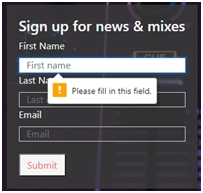</h2>

    3. As a First Time Visitor, I want to check if DRKS has social media.
        1. The Home page has links to DRKS’ Twitter feed as his only social media.  If he subsequently accumulates more this will be added.
            <h2 align="left">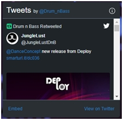</h2>
        2. The visitor is able to use the contact form for other queries relating to social media.

    4. As a First Time Visitor, I want to hear DRKS' music.
        1. There is a Mixes navbar option which links to the Mixes page containing DRKS mixes from SoundCloud and MixCloud.
        2. The sign-up form is clearly described as being for news and mixes.  A visitor is invited to complete and submit this for more music.

-   #### Returning Visitor Goals

    1. As a Returning Visitor, I want to send DRKS a message.
        1. There is a Contact navbar option which links to the Contact page containing a message form.  The Home page has a request form for news and mixes.  
            <h2 align="left">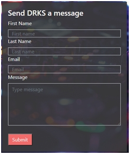</h2>

    2. As a Returning Visitor, I want to check when his next live date is.
        1. There is a Dates navbar option which links to the Dates page containing up-coming live shows.

    3. As a Returning Visitor, I want to check out more of DRKS’ music and social media.
        1. There is a Mixes navbar option which links to the Mixes page containing DRKS mixes from SoundCloud and MixCloud.
        2. The Home page has a sign-up form for more mixes.

-   #### Frequent User Goals

    1. As a Frequent User, I want to book DRKS for my party.
        1. There is a Contact navbar option which links to the contact page containing a message form.  

    2. As a Frequent User, I want to sign up for news and mixes.
        1. The Home page has a request form for news and mixes.

    3. As a Frequent User, I want to book for the next live date.
        1. The Dates page shows up-coming live shows with a booking option.
        <h2 align="left"></h2>
        <h2 align="left">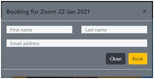</h2>
        2. Once a booking form is submitted the user receives a confirmation alert.  This can be edited with more specific details if necessary.
        <h2 align="left">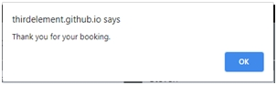</h2>
        3. Due to Covid-19 DRKS is offering Zoom shows only.  On receipt of a booking request DRKS will send a Zoom link to the email provided.  This is out of scope of the project.

### Further Testing

-   The website was tested on Google Chrome, Microsoft Edge, Microsoft Internet Explorer, Mozilla Firefox and Safari browsers.
-   The website viewing experience and functionality was checked on devices including Desktop, laptop, tablet, iPad, iPhone X, iPhone SE and Samsung S10e.  A broader range of simulated devices were used using the Google Developer features and Responsinator.com website.
-   Thorough testing of features and links were completed by the developer, friends, family and professional associates.

### Known Bugs

-   At a screen width below 270px the booking form spills outside the container div.  This is below the minimum screen width of any device tested (280px – Galaxy Fold) and so no further fix was implemented.
-   In Microsoft Internet Explorer 11 the Twitter feed often does not load.  On Twitter’s website IE11 is not listed as a compatible browser (see About twitter.com supported browsers).
-   In Microsoft Internet Explorer 11 the SoundCloud banner borders are not removed.

## Deployment

### GitHub Pages

The project was deployed to GitHub pages using the below procedure:

1.	Log into GitHub, click on Repositories and select the [djdarks repository](https://github.com/thirdelement/djdarks). 
2.	Click Settings.
3.	In GitHub Pages, Source, select the Branch as Master and click Save.
4.	The page will refresh and the published site [link](https://thirdelement.github.io/djdarks/) will then appear in GitHub Pages.

## Credits

### Code

-   [Bootstrap 4.5.3](https://getbootstrap.com/docs/4.5/getting-started/introduction/): Bootstrap 4.5.3 was used throughout the site so that it is responsive to different devices and viewport sizes.

-   Code was used from external sources in the following instances:
    - [Creating a custom navbar toggler](https://stackoverflow.com/questions/42586729/bootstrap-4-change-hamburger-toggler-color)
    - [Changing the navbar toggle background colour and outline](https://stackoverflow.com/questions/50668594/remove-border-color-for-navbar-toggler-hamburger-icon-bootstrap-4)
    - [Sign-up and Contact form design ](https://courses.codeinstitute.net/courses)
    - [Form submission alerts](https://www.w3schools.com/js/js_popup.asp)

### Content

-   All content was written by the developer apart from the instances of external source use mentioned above.

### Media

-   The background images for the Home, Mixes, Dates and Contact pages were found at https://unsplash.com/.   The image for the About page was found at https://www.deviantart.com/.  There are links to the Creator page for each below:
    - Homepage - [Nikolai Chernichenko](https://unsplash.com/@perfectcoding?utm_source=unsplash&amp;utm_medium=referral&amp;utm_content=creditCopyText)
    - About - [Pulse-v2](https://www.deviantart.com/pulse-v2/art/Croydon-Skyline-16563186)
    - Mixes - [Fred Moon](https://unsplash.com/@fwed?utm_source=unsplash&amp;utm_medium=referral&amp;utm_content=creditCopyText)
    - Dates - [Raphael Schaller](https://unsplash.com/@raphaelphotoch?utm_source=unsplash&amp;utm_medium=referral&amp;utm_content=creditCopyText)
    - Contact - [Alexander Popov](https://unsplash.com/@5tep5?utm_source=unsplash&utm_medium=referral&utm_content=creditCopyText)

The images of DJ DRKS were provided by DJ DRKS.

### Acknowledgements

-   My mentor provided advice throughout the build process as well as technical and design feedback.
